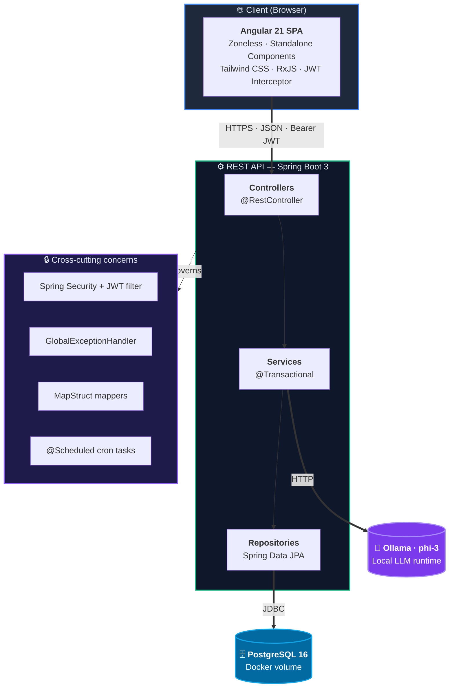

<div align="center">

# 🤖 Vantryx AI

### Intelligent inventory management with prescriptive analysis powered by a local LLM

*Inventory management + Machine Learning + Large Language Models — all running locally*


</div>

---

## 📖 Table of contents

- [Description](#-description)
- [Architecture](#-architecture)
- [Tech Stack](#-tech-stack)
- [Features](#-features)
- [Screenshots](#-screenshots)
- [Project structure](#-project-structure)
- [Getting started](#-getting-started)
- [Environment variables](#%EF%B8%8F-environment-variables)
- [API endpoints](#-api-endpoints)
- [Design decisions](#-design-decisions)
- [Roadmap](#-roadmap)
- [Author](#-author)

---

## 📋 Description

**Vantryx AI** is a full-stack intelligent inventory management system that combines traditional ERP operations with two layers of artificial intelligence. Built on a **Spring Boot 3** backend and an **Angular 21 zoneless** frontend, it centralises products, suppliers, purchase orders, sales, and movement audit trails (kardex) into a single reactive dashboard, while delegating decision support to algorithmic and generative AI components running entirely on the host machine.

At its core lies a **predictive engine** that analyses sales velocity, lead times, and historical movements to forecast when each SKU will hit its minimum threshold. The system computes a *days-until-stockout* metric, classifies items into `STABLE`, `WARNING` and `CRITICAL` states, and proactively notifies the user through dashboard alerts and automated Excel reports delivered by email via a cron-based `@Scheduled` task — turning reactive stock management into a proactive workflow. On top of this deterministic layer, a **prescriptive AI assistant** powered by **Spring AI** and **Ollama (phi-3)** runs a 3.8 B-parameter LLM **100 % locally**, generating natural-language recommendations on restocking, pricing and supplier strategy without sending a single byte of commercial data to the cloud.

---

## 🏛 Architecture

Vantryx AI follows a classic **layered architecture** on the backend (Controller → Service → Repository → Persistence) with cross-cutting concerns handled through Spring's interceptor and aspect chain. The frontend is a single-page application that consumes the REST API and delegates all business logic to the server, keeping the client thin and focused on presentation.

### High-level diagram



### Backend layering

| Layer | Responsibility | Examples |
|---|---|---|
| **Controller** | HTTP entry points, request validation, response shaping | `ProductController`, `SaleController`, `AIAdvisorController` |
| **Service** | Business logic, transactional boundaries, orchestration | `SaleService`, `PurchaseOrderService`, `StockMovementService` |
| **Repository** | Data access via Spring Data JPA derived queries | `ProductRepository`, `SaleRepository` |
| **Mapper** | Compile-time DTO ↔ Entity conversion via MapStruct | `ProductMapper`, `SaleMapper` |
| **Domain (model)** | JPA entities with Lombok annotations | `Product`, `Sale`, `StockMovement` |
| **Cross-cutting** | Security, exception handling, scheduling | `SecurityConfig`, `GlobalExceptionHandler`, `StockReportScheduler` |

### Request lifecycle

A typical authenticated request flows through the system as follows:

1. **Client** issues an HTTP call with `Authorization: Bearer <jwt>`
2. **JWT filter** (Spring Security) validates the token signature (HS256) and populates `SecurityContextHolder`
3. **Controller** receives the request, deserialises the body into a DTO, and validates it
4. **Service** opens a `@Transactional` boundary, executes business logic, and orchestrates repository calls
5. **Repository** translates method names into SQL via Spring Data JPA / Hibernate
6. **Mapper** converts entities back to response DTOs (compile-time, no reflection)
7. **Controller** serialises the response to JSON; **GlobalExceptionHandler** intercepts any thrown exception and maps it to the appropriate HTTP status

### Specialised flows

- **AI Advisor** — `AIAdvisorController` assembles a structured prompt from product data, calls Ollama through Spring AI's `ChatClient`, and streams the response back as `text/plain` (15–60 s typical latency).
- **Scheduled reports** — `StockReportScheduler` runs on a cron expression, generates an `.xlsx` workbook via Apache POI, and dispatches it through Spring Mail in a single transaction.
- **Frontend state** — Angular components communicate through `@Output() EventEmitter` (child → parent) and shared `BehaviorSubject` streams in services (sibling components), avoiding the need for a global state library.

---

## 🛠 Tech Stack

| Layer | Technology |
|---|---|
| **Runtime** | Java 21 LTS |
| **Backend framework** | Spring Boot 3.3.4 (Web, Data JPA, Validation, Mail) |
| **Database** | PostgreSQL 16 (Docker) |
| **ORM** | Spring Data JPA + Hibernate 6 (`ddl-auto=update`) |
| **DTO mapping** | MapStruct 1.5.5 (compile-time, zero reflection) |
| **Boilerplate reduction** | Lombok |
| **Security** | Spring Security 6 + JWT (jjwt 0.11.5, HS256, 24 h expiration) |
| **Password hashing** | BCryptPasswordEncoder (factor 10) |
| **API documentation** | springdoc-openapi 2.6.0 (Swagger UI) |
| **Excel reports** | Apache POI 5.2.5 (XSSF workbook) |
| **Email delivery** | Spring Mail (Jakarta) + SMTP (Mailtrap in dev) |
| **Scheduling** | Spring `@Scheduled` cron tasks |
| **AI orchestration** | Spring AI 1.0.0-M5 (`ChatClient` abstraction) |
| **LLM runtime** | Ollama — phi-3 model (3.8 B params, ~2.3 GB, 100 % local) |
| **Frontend framework** | Angular 21.2 (zoneless, standalone components) |
| **Frontend language** | TypeScript 5.9 (strict mode) |
| **Styling** | Tailwind CSS 4.2 (utility-first, dark theme) |
| **State & reactivity** | RxJS 7.8 + `BehaviorSubject` patterns |
| **HTTP client** | Angular HttpClient + JWT auth interceptor |
| **Backend testing** | JUnit 5, Mockito, Spring Security Test, H2 (in-memory) |
| **Frontend testing** | Vitest 4.0 + jsdom |
| **Build tools** | Maven 3.9 (`mvnw` wrapper), Angular CLI 21.2, npm 10.9 |
| **Containerization** | Docker Compose (PostgreSQL service with persistent volume) |
| **Configuration management** | Environment variables + Spring profile-based properties |

---

## ✨ Features

### 📊 Executive dashboard
- Real-time inventory valuation aggregated across all SKUs
- Critical-stock panel with one-click restocking action
- Category cards with contextual navigation to filtered inventory views

### 📦 Inventory management
- Full CRUD for products with category, supplier, prices, minimum stock and lead time
- Combined filters (free-text search + category) synchronised across views via `BehaviorSubject`
- Stock-adjustment modal with predefined reasons (sale, supplier entry, return, loss, manual adjustment)

### 🏭 Suppliers
- Complete CRUD with contact information, address and email
- Safe deletion guarded against referential-integrity violations (cannot delete if products are linked)

### 🛒 Purchase orders (procurement)
- State machine: `DRAFT` → `ORDERED` → `RECEIVED`
- **Automatic suggestions** for products below their minimum threshold
- Reception flow updates stock and emits a kardex movement in a single transaction
- Manual creation modal with dynamic total calculation

### 💰 Sales
- Sale registration with automatic stock deduction inside a `@Transactional` boundary
- **Stock-prediction engine** computing days-until-stockout from sales velocity (linear regression over recent history)
- Full sales history with timestamp and user attribution

### 📋 Stock movements (kardex)
- Immutable audit trail of every stock modification
- Aggregated statistics: average velocity, days until depletion, most frequent movement type
- Per-user and per-reason traceability

### 📊 Reports
- `.xlsx` report generation via Apache POI listing critical-stock products
- **Automatic email delivery** to the user in the same request
- Cron-scheduled task (`@Scheduled`) for recurring reports without manual trigger

### 🤖 AI Assistant (slide-over panel)
- Accessible from any view via a floating button in the header
- Prescriptive analysis of any product in natural language
- Per-session history of past consultations
- **100 % local execution** — no commercial data leaves the host
- Closes with `Escape`, overlay click, or `×` button

---

---

## 📁 Project structure

```
Vantryx_project/
│
├── docker-compose.yml                # PostgreSQL 16 + persistent volume
├── README.md
│
├── vantryx-back/                     # ── BACKEND ───────────────────────
│   ├── pom.xml                       # Maven build · Spring Boot parent
│   ├── mvnw / mvnw.cmd               # Maven wrapper
│   └── src/main/
│       ├── java/com/vantryx/api/
│       │   ├── VantryxApiApplication.java
│       │   ├── config/               # SecurityConfig, JWT, CORS, DataInitializer
│       │   ├── controller/           # 12 REST controllers
│       │   ├── service/              # Business logic · @Transactional
│       │   ├── repository/           # Spring Data JPA interfaces
│       │   ├── model/                # JPA entities (Product, Sale, …)
│       │   ├── dto/                  # Request / response DTOs
│       │   ├── mapper/               # MapStruct interfaces
│       │   ├── exception/            # GlobalExceptionHandler + custom exceptions
│       │   ├── scheduler/            # StockReportScheduler (@Scheduled)
│       │   └── task/                 # Async tasks
│       └── resources/
│           ├── application.properties                       # Placeholders ${VAR} only
│           └── application-local.properties.example         # Template for devs
│
└── vantryx-front/                    # ── FRONTEND ──────────────────────
    ├── package.json                  # Angular 21 · Tailwind 4 · Vitest
    ├── angular.json                  # fileReplacements for production builds
    ├── tailwind.config.js
    └── src/
        ├── index.html                # Meta tags + Open Graph
        ├── main.ts                   # Zoneless bootstrap
        ├── environments/
        │   ├── environment.ts        # Dev → localhost:8080
        │   └── environment.prod.ts   # Prod → configurable API base URL
        └── app/
            ├── app.component.{ts,html,css}
            ├── components/           # 10 standalone components
            │   ├── login/
            │   ├── inventario/
            │   ├── proveedores/
            │   ├── compras/
            │   ├── purchase-order-modal/
            │   ├── ventas/
            │   ├── movimientos/
            │   ├── reportes/
            │   └── asistente-ia/     # Slide-over panel
            ├── services/             # 11 HTTP services
            ├── models/               # TypeScript interfaces
            └── interceptors/         # JWT auth interceptor
```

---

## 🚀 Getting started

The project is a monorepo containing both backend and frontend. After cloning, you'll have a fully working local environment with PostgreSQL (Docker), the Spring Boot API, the Angular SPA and the local LLM running.

### Prerequisites

| Tool | Minimum version | Verify with |
|---|---|---|
| **JDK** | 21 | `java -version` |
| **Maven** | 3.9+ *(or use the bundled `./mvnw` wrapper)* | `mvn -v` |
| **Node.js** | 20.x LTS | `node -v` |
| **npm** | 10.x | `npm -v` |
| **Docker Desktop** | 24+ | `docker --version` |
| **Ollama** | latest — [download here](https://ollama.com/download) | `ollama --version` |

---

### 1 · Clone the repository

```bash
git clone https://github.com/[your-github-username]/vantryx-ai.git
cd vantryx-ai
```

### 2 · Start PostgreSQL (Docker)

```bash
docker compose up -d postgres
```

This boots PostgreSQL 16 on `localhost:5432` with database `vantryx_db`. Data persists in a Docker volume (`vantryx_db_data`) so it survives container restarts.

> ✅ **Verify**: `docker ps` should list a container named `vantryx-db-container` in `Up` state.

### 3 · Pull the LLM model (Ollama)

```bash
ollama pull phi3      # downloads ~2.3 GB the first time
ollama serve          # leave running in a background terminal
```

> ✅ **Verify**: open `http://localhost:11434` in your browser — you should see `"Ollama is running"`.

### 4 · Configure backend credentials

```bash
cd vantryx-back/src/main/resources
cp application-local.properties.example application-local.properties
```

Open `application-local.properties` and fill in:

```properties
DB_USERNAME=admin
DB_PASSWORD=admin
JWT_SECRET=<generate with: openssl rand -hex 32>
MAIL_USERNAME=<your Mailtrap user, optional>
MAIL_PASSWORD=<your Mailtrap password, optional>
```

> 🔒 This file is in `.gitignore` — it will never be committed to the repository.

### 5 · Run the backend

```bash
cd vantryx-back
./mvnw spring-boot:run -Dspring-boot.run.profiles=local
```

The backend listens on **http://localhost:8080**.

> ✅ **Verify**:
> - Swagger UI → `http://localhost:8080/swagger-ui.html`
> - Default admin user (auto-created on first boot): `admin` / `admin123`

### 6 · Run the frontend

In a new terminal:

```bash
cd vantryx-front
npm install
npm start
```

The SPA is now available at **http://localhost:4200**. Log in with `admin` / `admin123` and you're in.

---

### 🧰 Troubleshooting

| Symptom | Cause | Fix |
|---|---|---|
| `Connection refused` on backend startup | PostgreSQL container not running | `docker compose up -d postgres` |
| `Could not load Ollama` in the AI Assistant | Ollama daemon stopped | Run `ollama serve` in a terminal |
| `401 Unauthorized` after login | JWT token expired (24 h lifetime) | Log out and log in again |
| Slow first AI response (60 s+) | Model loading from disk into RAM | Subsequent calls drop to ~15 s |
| `Port 8080 already in use` | Another Java process running | Kill it or change `server.port` in `application-local.properties` |
| `npm install` fails on Windows | Long path issues | Run terminal as administrator, or `git config --system core.longpaths true` |

---

## ⚙️ Environment variables

All sensitive credentials are loaded from environment variables (Spring) or from the `application-local.properties` file (excluded from the repository).

| Variable | Description | Example |
|---|---|---|
| `DB_URL` | PostgreSQL JDBC URL | `jdbc:postgresql://localhost:5432/vantryx_db` |
| `DB_USERNAME` | Database username | `admin` |
| `DB_PASSWORD` | Database password | `admin` |
| `JWT_SECRET` | HS256 signing key for tokens (256 bits minimum) | Generate with `openssl rand -hex 32` |
| `OLLAMA_BASE_URL` | Ollama server endpoint | `http://localhost:11434` |
| `OLLAMA_MODEL` | LLM model identifier | `phi3` |
| `MAIL_HOST` | SMTP host | `sandbox.smtp.mailtrap.io` |
| `MAIL_PORT` | SMTP port | `587` |
| `MAIL_USERNAME` | SMTP username | — |
| `MAIL_PASSWORD` | SMTP password | — |

**Frontend** (`src/environments/environment.prod.ts`):

| Variable | Description |
|---|---|
| `apiBaseUrl` | Production API base URL (e.g. `https://api.yourdomain.com`) |

---

## 🔌 API endpoints

> Full interactive documentation available at Swagger UI: `http://localhost:8080/swagger-ui.html`

### Authentication
| Method | Endpoint | Description |
|---|---|---|
| `POST` | `/api/auth/login` | Login with `{username, password}` → returns JWT |
| `POST` | `/api/auth/register` | Register a new user |

### Products & categories
| Method | Endpoint | Description |
|---|---|---|
| `GET` | `/api/products` | List all products |
| `POST` | `/api/products` | Create a product |
| `PUT` | `/api/products/{id}` | Update a product |
| `DELETE` | `/api/products/{id}` | Delete a product |
| `GET` | `/api/categories` | List categories |
| `DELETE` | `/api/categories/{id}/move-to/{targetId}` | Delete category reassigning its products |

### Suppliers
| Method | Endpoint | Description |
|---|---|---|
| `GET\|POST\|PUT\|DELETE` | `/api/v1/suppliers[/{id}]` | Full CRUD |

### Purchase orders
| Method | Endpoint | Description |
|---|---|---|
| `GET` | `/api/purchase-orders/pending` | Orders in `DRAFT` or `ORDERED` state |
| `POST` | `/api/purchase-orders` | Create a manual order |
| `POST` | `/api/purchase-orders/generate-suggestions` | **Auto-generate draft orders for products below minimum stock** |
| `PUT` | `/api/purchase-orders/{id}/confirm` | `DRAFT` → `ORDERED` |
| `PUT` | `/api/purchase-orders/{id}/receive` | Mark as received and update stock |

### Inventory (kardex)
| Method | Endpoint | Description |
|---|---|---|
| `POST` | `/api/inventory/movement` | Register `IN`/`OUT`/`ADJUSTMENT` movement |
| `GET` | `/api/inventory/product/{id}/history` | Movement history for a product |

### Sales
| Method | Endpoint | Description |
|---|---|---|
| `GET` | `/api/sales` | List all sales |
| `POST` | `/api/sales` | Register a sale (deducts stock) |
| `GET` | `/api/stats/summary` | Aggregated financial stats |
| `GET` | `/api/ai/predict/{productId}` | **Days-until-stockout prediction** |

### Reports
| Method | Endpoint | Description |
|---|---|---|
| `GET` | `/api/reports/inventory` | Download Excel + automatic email delivery |

### AI advisor (LLM)
| Method | Endpoint | Description |
|---|---|---|
| `GET` | `/api/v1/ai/analyze/{productId}` | **Natural-language prescriptive analysis (15–60 s)** |

---

## 🧠 Design decisions

### Why Angular zoneless
Angular 21 makes it possible to run the application **without Zone.js**, eliminating a monkey-patching layer over the browser's native APIs. In exchange, change detection is no longer automatic — it must be triggered manually via `ChangeDetectorRef.detectChanges()` after every async callback. The result: smaller bundles, better runtime performance, and explicit control over the render cycle.

### Why Spring AI + Ollama
The obvious alternative (OpenAI / Anthropic / Gemini) requires uploading inventory data to third-party services. For an application that handles sensitive commercial information, this is unacceptable. **Spring AI** abstracts the LLM client and **Ollama** runs the `phi-3` model (~3.8 B parameters, ~2.3 GB) directly on the host machine — full privacy at zero cost.

### Why MapStruct over reflection-based mappers
MapStruct generates mapping code at **compile time** (no reflection, no runtime overhead). Combined with Lombok, it eliminates hundreds of boilerplate lines without sacrificing performance or type safety, and surfaces mapping errors at build time instead of runtime.

### Component communication pattern
Without Angular Router (the project is a single-page dashboard), navigation is managed via a `vistaActual` union-type field in `AppComponent` and `@Output() EventEmitter` for child-to-parent events. Shared state between sibling components flows through `BehaviorSubject` streams in services — see `CategoryService` for a reference implementation.

### Security
- JWT signed with HS256, 24-hour expiration
- Passwords hashed with `BCryptPasswordEncoder` (factor 10)
- Stateless server — token sent on `Authorization: Bearer <token>` header
- CORS configured per environment
- Secrets injected via environment variables; `application-local.properties` is gitignored

### Scheduled tasks
`StockReportScheduler` uses `@Scheduled` with a cron expression to generate and email recurring reports without manual intervention — a real-world example of how to automate operational workflows in a production-grade system.

---

## 🗺 Roadmap

Technical improvements that would take the project to the next level:

### Sharpen the edges
- [ ] Full authorization with `@PreAuthorize` and `ADMIN` / `USER` roles
- [ ] Bean Validation annotations (`@Valid`, `@NotNull`, `@Size`) on all DTOs
- [ ] Unit tests with JUnit 5 + Mockito (target: 70 % coverage)
- [ ] End-to-end frontend tests with Playwright
- [ ] CI/CD pipeline via GitHub Actions (lint, test, build)

### Production-ready
- [ ] Backend `Dockerfile` (multi-stage build)
- [ ] Frontend `Dockerfile` (Nginx + optional Angular SSR)
- [ ] `docker-compose.prod.yml` orchestrating the full stack (PostgreSQL + backend + frontend + Nginx reverse proxy)
- [ ] Real deployment (Railway / Fly.io / VPS with Coolify)
- [ ] TLS certificates via Let's Encrypt

### Functionality
- [ ] Multi-user with differentiated roles
- [ ] Multi-warehouse (stock per physical location)
- [ ] Barcode scanning via the browser camera
- [ ] Movement export to CSV / PDF
- [ ] Push notifications for critical-stock alerts
- [ ] Internationalisation (i18n) for EN / ES

### Advanced AI
- [ ] Product embeddings + semantic search (Spring AI Vector Store)
- [ ] Prompt fine-tuning based on each product's real history
- [ ] LLM quality metrics (response time, user thumbs up / down)
- [ ] Alternative models: `llama3.2`, `qwen2.5`, quality benchmarks

---

## 👤 Author

**[Marc Morena Herranz]**

- 💼 LinkedIn: www.linkedin.com/in/marc-morena-herranz-27b74334a
- 🐙 GitHub: https://github.com/marcmorena/Vantryx.AI
- 📧 Email: mmorena.denia@gmail.com

---

<div align="center">

**Vantryx AI** — Built with ☕, Angular and a LLM running on localhost

⭐ *If you found this project useful or interesting, consider giving it a star on GitHub*

</div>
